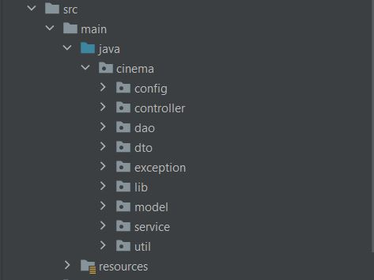

# 🎞️cinema-app 🎦

## Project description

A REST web-application that supports authentication, registration and other CRUD operations using MySQL as a database. 
It's based on the following technologies as: Hibernate framework, Spring Security and Spring MVC modules. 
Project was built according to SOLID principles, and using 3-tier architecture(controllers -> services -> DAO).
It uses JSON format for request and response. Also, it supports basic authentication. 
## 🎯 Features

+ POST - registration with USER(default) role
+ POST - authentication like a user(with USER, ADMIN, or USER/ADMIN roles)

    ADMIN:
+ GET - /users/by-email, /cinema-halls, /movies, /movie-sessions/available
+ POST - /cinema-halls, /movies, /movie-sessions
+ PUT - /movie-sessions/**
+ DELETE - /movie-sessions/**

    USER:
+ GET - /orders, /shopping-carts/by-user, /cinema-halls, /movies, /movie-sessions/available
+ POST - /orders/complete
+ PUT - /shopping-carts/movie-sessions
## Project structure

The model level is represented in the following diagram:

## 💻 Technologies:

- JAVA 11 or higher
- Maven 3
- Tomcat v.9.x.x
- MySQL v.8.x.x
- Spring WEB, SPRING Security v.5.2.2
- Hibernate v.5.4.27

## Installation

- Clone this project from GitHub;
- Install [MySQL](https://dev.mysql.com/doc/mysql-installation-excerpt/5.7/en/);
- Install [Apache Tomcat v.9.x.x](https://tomcat.apache.org/download-90.cgi) ;
- Change URL, username, password and JDBC driver in cinema-app\src\main\java\cinema\resources\db.properties;
- Configure Tomcat server:
    1. Edit configuration;
    2. Tomcat Server -> Local
    3. Deployment -> add -> artifact -> cinema-app:war exploded
    4. Application context : /
    5. Press apply -> okay.
